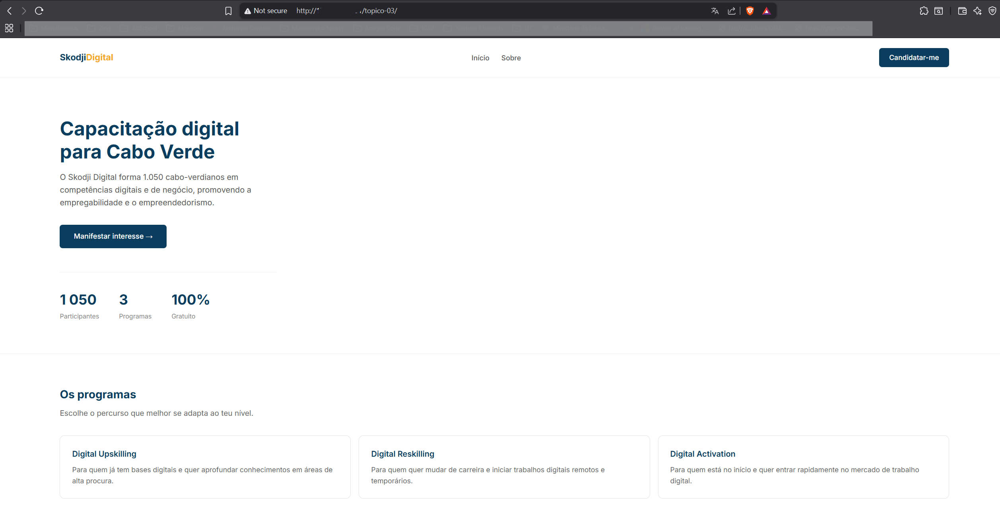
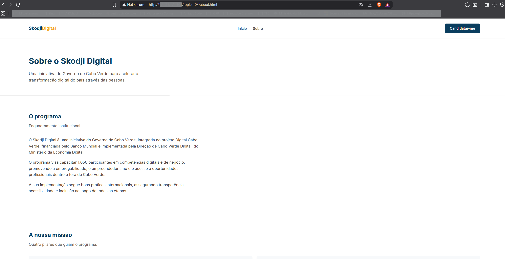
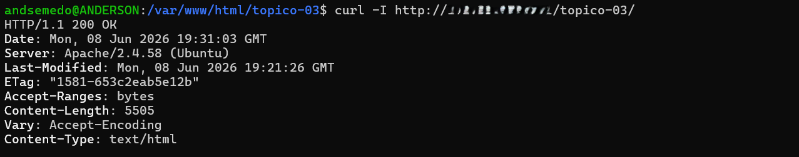
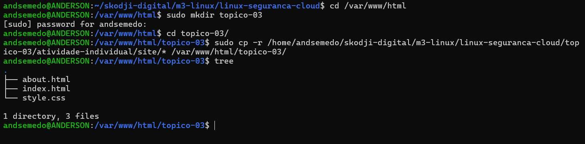

# Validação
## URLs testados
- `http://<MEU_IP>/topico-03/` ou `http://<MEU_IP>/topico-03/index.html`
  - Acessar a pagina inicial. O que vimos é o que está no ficheiro `index.html`.
- `http://<MEU_IP>/topico-03/about.html`
  - Acessar a pagina sobre. O que vimos é o que está no ficheiro `about.html`.

## Resultado dos testes
- Consegui acessar as paginas com sucesso.
- Tambem consegui navegar de uma pagina para outra.

## Evidências

**Pagina inicial**

**Pagina sobre**

**Retornando os headers do site utilizado o curl**

- o `HTTP/1.1 200 OK` diz-nos que foi possivel aceder o site com sucesso.

**Criar a pasta topico-03 e copiar os ficheiros do site para essa pasta**

## Observações