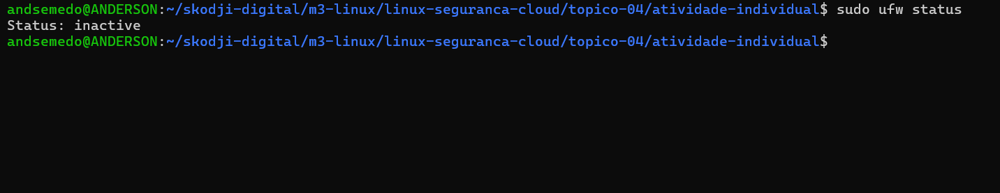
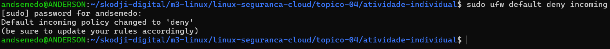
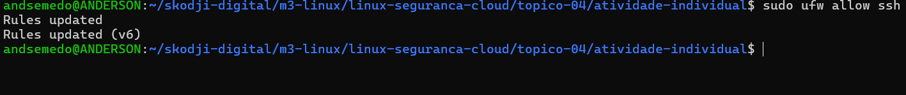
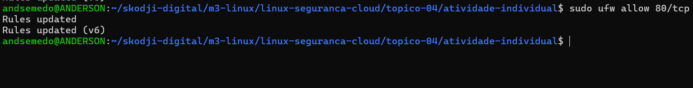
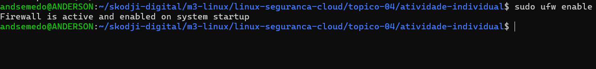

1. **Verificar estado do UFW**
- Para verificar o estado do ufw utilizamos o comando abaixo
- `sudo ufw status`
- 
- Como podemos ver na imagem o UFW se encontra inativo.

2. **Recusar por padrão todas as conexões de entrada**
- Para recusar por padrão todas as conexões de entrada utilizamos o seguinte comando.
- `sudo ufw default deny incoming`
- 

2. **Permitir SSH**
- Para conexões remotos temos que permitir o SSH. Para fazer isso utilizamos o comando a seguir.
- `sudo ufw allow ssh`
- 
- Ao permitir o SSH é retornado a mensagem de que a regra foi atualizada.

3. **Permitir HTTP**
- Para permitir HTTP utilizamos o seguinte comando.
- `sudo ufw allow 80`
- 
- Ao permitir o HTTP é retornado a mensagem de que a regra foi atualizada.

4. **Habilitar UFW**
- Para habilitar o UFW utilizamos o seguinte comando.
- `sudo ufw enable`
- 