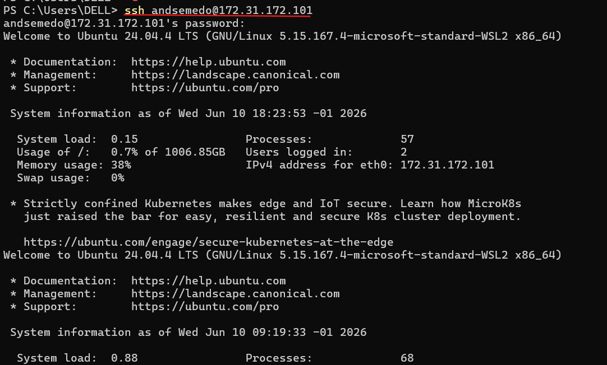
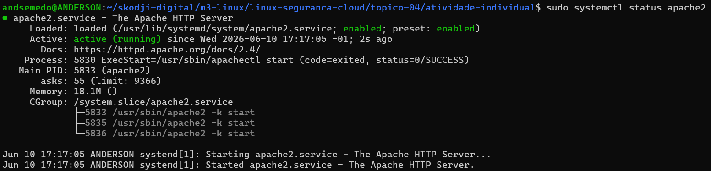
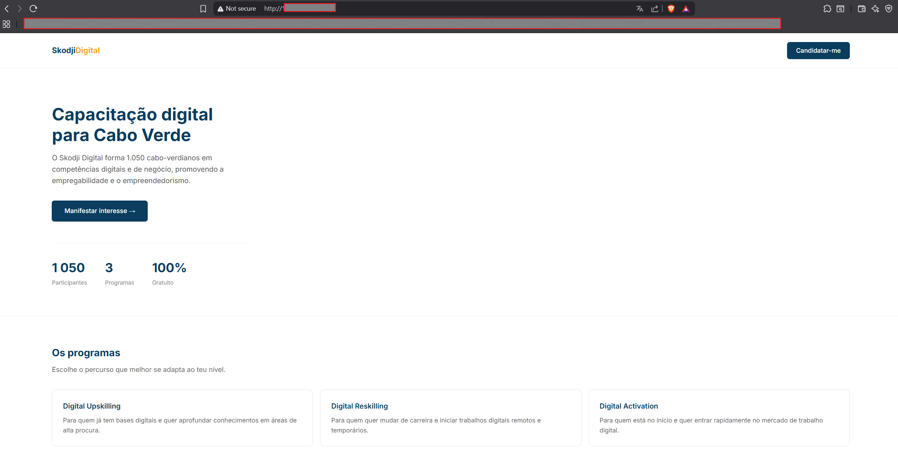

1. **Conectar ao servidor via SSH**
- Para conectar com o nosso servidor podemos utilizar o seguinte comando.
- `ssh andsemedo@${MEU_IP}`
- 
- Como podemos ver na imagem acima conseguimos conectar ao servido SSH com sucesso.

2. **Apache rodando**
- Para confirmar se o apache está rodando utilizamos o seguinte comando.
- `sudo systemctl status apache2`
- 

3. **Acessando a pagina web**
- 