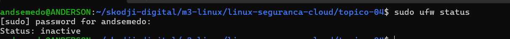
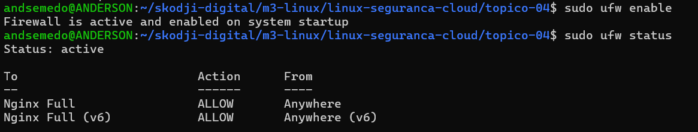
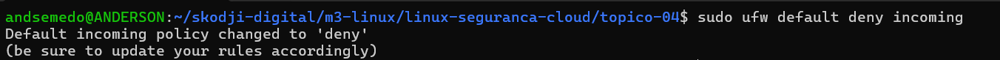
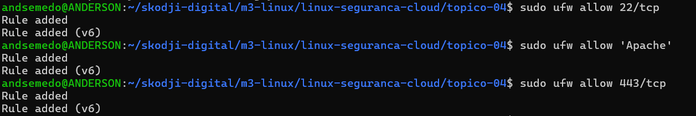
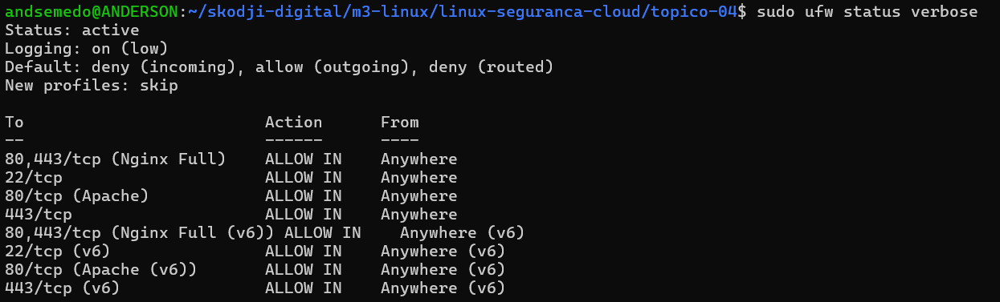
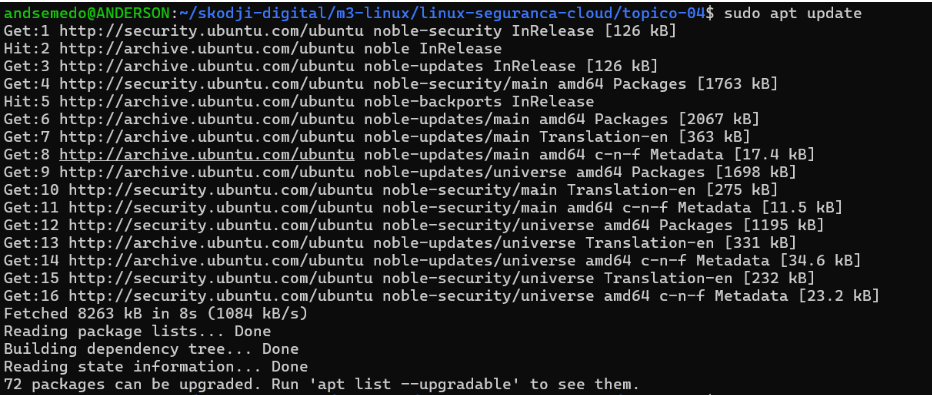
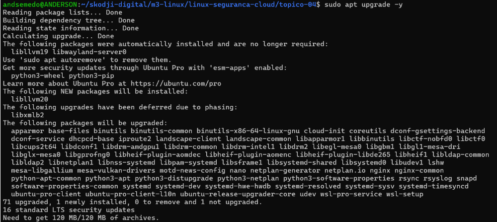
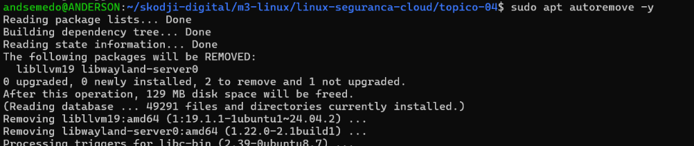
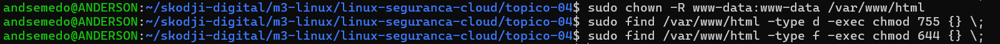

# Relatório do trabalho de grupo  

## Plano de segurança inicial para serviço web publicado 

## Identificação do grupo 

### Grupo: Breakout 7; 

### Elementos:
- Anderson Semedo
- Gilson Carvalho
- Silvania Correia
- Veronica Andrade
- Andreia Semedo 

### Papéis assumidos: 
- Administração do servidor, análise de segurança e documentação e validação. 

 
## Serviço analisado 

- **Serviço escolhido:** HTML com Apache (Cenário B) 

- **Porta**: 80  

- **Protocolo**: HTTP 

- **Diretório de publicação**: /var/www/html 

- **Componentes envolvidos**: Ubuntu Server, Apache HTTP Server, Página HTML, Navegador Web. 

- **Dependências Principais**: 
  - Sistema operativo Linux (Ubuntu Server);  
  - Apache;  
  - O serviço consiste numa página HTML estática, hospedada num servidor LINUX utilizando o servidor web apache, e como se trata de conteúdo estático, não existe necessidade de PHP nem de uma base de dados. 

## Comandos utilizados para hardening
Para a configuração da firewall foi utilizado a ferramenta `ufw`.

1. **Verificar se o `ufw` está instalado e ativo.**
  - `sudo ufw status`
  
  Como podemos ver na figura anterior o `ufw` encontrava-se inativo, para ativá-lo utilizamos o comanto a seguir. 

  - `sudo ufw enable`
  
  Ao ativar, é retornado uma mensagem dizendo que a firewall está ativo e habilitado. Consultado o estado novamento, pudemos ver que agora é ativo.

2. **Bloquear todas as conexões de entrada por padrão:**
  - `sudo ufw default deny incoming`
  

2. **Habilitar somente as portas necessárias**
  - Umas das boas práticas de segurança é habilitar somente as portas de que precisamos. Neste caso, o 22 para SSH, 80 para HTTP (porta utilizado pelo Apache) e 443 para HTTPs.
  - Para habilitar as portas utilizamos os comandos abaixo.
  - `sudo ufw allow 22/tcp` - para SSH
  - `sudo ufw allow 'Apache'` - para Apache
  - `sudo ufw allow 443/tcp` - para HTTPs
  

3. **Verificar regras da firewall**
  - Para ver as regras da firewall configuradas, utilizamos os comando a seguir.
  - `sudo ufw status verbose`
  

4. **Atualizar pacotes, aplicações e remover serviços que não estão utilizados**
  - Para atualizar os pacotes utilizamos o seguinte comando: `sudo apt update`
  
  
  - Para atualizar as aplicações utilizamos o seguinte comando: `sudo apt upgrade -y`
  

  - Para remover os pacotes que não estão sendo utilizados por nenhum serviço utilizamos o seguinte comando: `sudo apt autoremove -y`
  

5. **Rever permissões aplicadas em `/var/www/html`**
  - Utilizamos o comando: `sudo chown -R www-data:www-data /var/www/html` - para alterar o proprietário e o grupo de um diretório e tudo dentro dele.

  - `sudo find /var/www/html -type d -exec chmod 755 {} \;` - para dar todas as permissões sob as pastas. Enquanto que os outros utilizadores e grupos só podem fazer leitura.

  - `sudo find /var/www/html -type f -exec chmod 644 {} \;` - para dar todas as permissões sob os ficheiros. Enquanto que os outros utilizadores e grupos só podem fazer leitura.
  
  